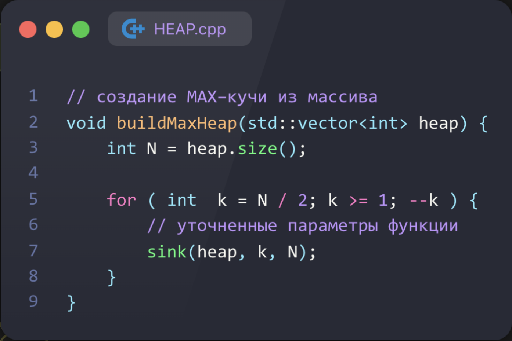
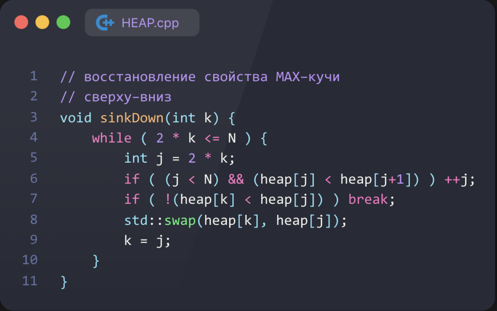
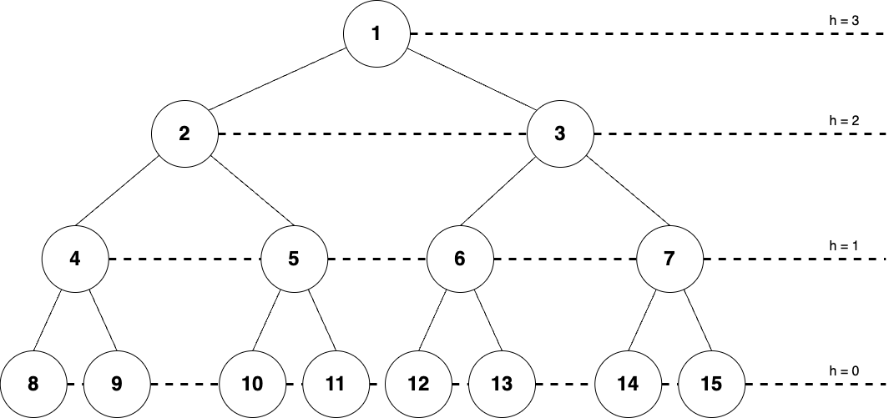

# Сложность функции `buildMaxHeap`

Заметим, что время работы `sink` в том или ином узле зависит от высоты этого узла. Далее будем рассматривать только "полное" дерево, то есть кучу в которой $2^{h+1} - 1$ элементов, где $h$ — высота корня.

Заметим, что на каждой высоте $h$ количество "поддеревьев" — степень двойки. Учитывая, наложенное ограничение на количество элементов кучи $n$ получим, что на каждой высоте $\frac{n + 1}{2^{h+1}}$

Теперь обратим внимание на цикл `for` внутри функции `buildMaxHeap`, который пробегает по всем "поддеревьям" высоты $h \in \{1..\lfloor \log n \rfloor\}$ и запускает функцию `sink`, работающую за `O(h)`.

Запишем T(n) — функция временной сложности `buildMaxHeap`:

$$
\begin{align*}
T(n) &= \sum_{h = 0}^{\lfloor \log n \rfloor} \frac{n + 1}{2^{h+1}} O(h) + O(1)\\
&= \sum_{h = 0}^{\lfloor \log n \rfloor} \frac{n}{2^{h+1}} O(h) + \sum_{h = 0}^{\lfloor \log n \rfloor} \frac{1}{2^{h+1}} O(h) + O(1)\\
&\leq O\left(n \sum_{h = 1}^{\infty} \frac{h}{2^{h}}\right) + O\left(\sum_{h = 1}^{\infty} \frac{h}{2^{h}}\right) + O(1) = O(n)
\end{align*}
$$

Итак,

$$
T(n) = O(n)
$$