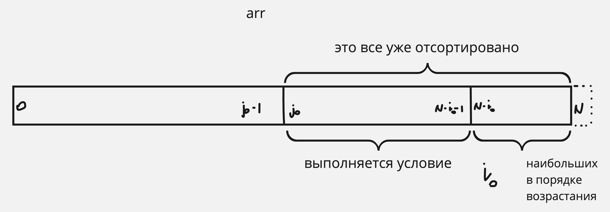

# Семинар 1

## ДЗ

### Сортировка пузырьком

```cpp
void bubbleSort(std::vector<int>& arr) {
    size_t N = arr.size();
    for (size_t i = 0; i < N; ++i) {
        for (size_t j = 0; j < N - i - 1; ++j ) {
            if (arr[j] > arr[j + 1]) {
                std::swap(arr[j], arr[j + 1]);
            }
        }
    }
}
```

#### Корректность алгоритма

* **Инвариант внешнего цикла:** подмассив $\{arr[i] \mid  i \in (N - i - 1, N)\}$ состоит из $i$ наибольших элементов исходного массива, расположенных в порядке возрастания.
* **INIT:** при инициализации цикла $i = 0$, тогда $\{arr[i] \mid  i \in (N - 1, N)\} = \empty$ – отсортированный подмассив (тривиальный случай)
* **MNT:** во внутреннем цикле находится $(i + 1)$-ый наибольший элемент исходного массива и переставляется на место $arr[N - i - 1]$
  * *Инвариант внутреннего цикла:* подмассив $\{ arr[0], arr[1], \dots, arr[j] \}$ состоит из элементов оригинального $\{ arr[0], arr[1], \dots, arr[j] \}$, причем $\max(arr[0], arr[1], \dots, arr[j]) = arr[j]$
  * *inner INIT:* при инициализации цикла $j = 0$, тогда $\max(\{ arr[0] \}) = arr[0]$
  * *inner MNT:* больший элемент из последовательной пары всегда оказывается "правее" меньшего элемента этой пары. За счет того что пары рассматриваются последовательно и первый элемент текущей пары – бОльший элемент предыдущей пары, на каждом шаге больший элемент оказывается последним.
  * *inner TRM:* причиной окончания цикла является нарушение условия $j < N - i - 1$. Так как на каждом шаге переменная $j$ увеличивалась на 1, то в конце работы цикла $j = N - i - 1$. Тогда $\max(arr[0], arr[1], \dots, arr[N - i - 1]) = arr[N - i - 1]$
  * Таким образом, на каждой итерации один элемент ($(i + 1)$-ый наибольший) занимает свое место в отсортированном массиве.
* **TRM:** причиной окончания цикла является нарушение условия $i < N$. Так как на каждом шаге переменная $i$ увеличивалась на 1, то в конце работы цикла $i = N$. Тогда подмассив $\{arr[i] \mid  i \in (N - i - 1, N)\} = \{arr[i] \mid  i \in (-1, N)\} = arr$ содержит $i$ наибольших элементов, расположенных в порядке возрастания, значит весь массив отсортирован в порядке возрастания $\Rightarrow$ алгоритм верен.


#### Оптимизации

> Небольшие изменения алгоритма, например, проверка дополнительных условий, которые в определенной конфигурации массива позволят не выполнять уже не нужные операции
> 
> -- <cite>Нестеров Роман Александрович</cite>

##### Первый уровень

Рассмотрим изначально отсортированный массив. Текущий алгоритм будет отрабатывать точно так же, как и на неотсортированной последовательности.
Как вообще можно "отловить" отсортированный массив?

$arr.isSorted() \iff \forall i \in [0, N - 1) \colon arr[i] \le arr[i + 1]$

Заметим, что в приведенном алгоритме при $i = 0$ внутренний цикл как раз и проверяет нарушение условия выше, то есть, если при конкретном массиве условие в конструкции $\operatorname{if}$ не выполнилось ни разу, то исходный массив отсортирован.

Расширим нашу оптимизацию для произвольного значения $i$. Внутренний цикл проверяет нарушение условия для подмассива $\{ arr[0], arr[1], \dots, arr[N - i - 1] \}$. Если на какой-то итерации окажется, что условие конструкции $\operatorname{if}$ не выполнилось ни разу, то подмассив отсортирован. Это значит, что последующие проверки не имеют смысла.

```cpp
void optimizedBubbleSort(std::vector<int>& arr) {
    size_t N = arr.size();
    for (size_t i = 0; i < N; ++i) {
        bool sorted = true;
        for (size_t j = 0; j < N - i - 1; ++j ) {
            if (arr[j] > arr[j + 1]) {
                std::swap(arr[j], arr[j + 1]);
                sorted = false;
            }
        }
        if (sorted) {
            return;
        }
    }
}
```

##### Что еще можно придумать?

Зафиксируем $i_{0}$ ($i_{0}$-ю итерацию). Допустим, что на этой итерации внутри внутреннего (хех) цикла выполнилось условие конструкции $\operatorname{if}$, запомним последнее такое $j$, что выполнилось условие – пусть при $j=j_{0}$. Тогда верно: $arr[j_0] < arr[j_0 + 1] \le arr[j_0 + 2] \le \dots \le arr[N - i_{0} - 1]$



На следующей итерации внешнего цикла ($i_{0} + 1$) нет необходимости проходиться по элементам $arr[j_0], arr[j_0 + 1], \dots, arr[N - i_0]$, так как они уже упорядочены.

```cpp
void optimizedBubbleSort(std::vector<int>& arr) {
    size_t N = arr.size();
    size_t j0 = N - 1;
    for (size_t i = 0; i < N; ++i) {
        size_t last_swap{};
        for (size_t j = 0; j < j0; ++j ) {
            if (arr[j] > arr[j + 1]) {
                std::swap(arr[j], arr[j + 1]);
                last_swap = j;
            }
        }
        j0 = last_swap; 
        if (!j0) {
            return;
        }
    }
}
```

### Shellsort

```c++
void shellSort(std::vector<int> arr) {
    size_t N = arr.size();
    for (size_t interval = N / 2; interval > 0; interval /= 2) {
        for (size_t i = interval; i < N; ++i) {
            int tmp = arr[i];
            for (size_t j = i; j >= interval && arr[j - interval] > tmp; j -= interval) {
                arr[j] = arr[j - interval];
            }
            arr[j] = tmp;
        }
    }
}
```

Ниже рассматривается только стандартная, разработанная Шеллом, длина промежутка.

#### Конфигурация худшего случая

Идея Shellsort в первую очередь основывается на том, что массив разбивается на непересекающиеся подпоследовательности, число которых с каждой итерацией уменьшается вдвое, а длина каждой подпоследовательности увеличивается вдвое (погрешность на округление). На каждой такой итерации массив сортируется с помощью сортировки вставками.

Пусть количество элементов массива – $N$, тогда при произвольно выбранном $N$ при округлении вниз во время деления количества подпоследовательностей на два "неявно" происходит слияние (merge) так, что образуется совершенно новая подпоследовательность, элементы которой на предыдущей итерации были совсем в разных подпоследовательностях 🤯.

Приведем пример для $N = 30$:
$$
(a_{1}, a_{16}), (a_{2}, a_{17}), \dots, (a_{15}, a_{30}) \\
(a_{1}, a_{8}, a_{15}, a_{22}, a_{29}), (a_{2}, a_{9}, a_{16}, a_{23}, a_{30}), \dots, (a_{7}, a_{14}, a_{21}, a_{28}) \\
(a_{1}, a_{4}, a_{7}, \dots, a_{28}), (a_{2}, a_{5}, a_{8}, \dots, a_{29}), (a_{3}, a_{6}, a_{9}, \dots, a_{30}) \\
(a_{1}, a_{2}, a_{3}, \dots, a_{30})
$$

Рассмотрим случай при $N = 2^m, m \in \mathbb{N}$: этот случай отличается тем, что на каждой (кроме последней) итерации в подпоследовательности не может одновременно находится элементов, имеющих четный номер, и элементов, имеющих нечетный номер. Причем всегда происходит слияние ровно двух подпоследовательностей, полученных на предыдущем шаге, в одну.

Приведем пример для $N = 2^{5} = 32$:
$$
(a_{1}, a_{17}), (a_{2}, a_{18}), (a_{3}, a_{19}), \dots, (a_{16}, a_{32}) \\
(a_{1}, a_{9}, a_{17}, a_{25}), (a_{2}, a_{10}, a_{18}, a_{26}), \dots, (a_{8}, a_{16}, a_{24}, a_{32}) \\
(a_{1}, a_{5}, a_{9}, \dots, a_{29}), (a_{2}, a_{6}, a_{10}, \dots, a_{30}), (a_{3}, a_{7}, a_{11}, \dots, a_{31}),  (a_{4}, a_{8}, a_{12}, \dots, a_{32}) \\
(a_{1}, a_{3}, a_{5}, \dots, a_{31}), (a_{2}, a_{4}, a_{6}, \dots, a_{32}) \\
(a_{1}, a_{2}, a_{3}, \dots, a_{32})
$$

Осталось подобрать входные данные так, что каждый шаг сортировки вставками при разных интервалах достигал своего худшего случая. Однако на каждом шаге происходит слияние уже упорядоченных последовательностей, поэтому худший случай выглядит вот так (для примера подпоследовательности длины $4$):


В таком случае для каждой такой подпоследовательности длины $n$ необходимо $1 + 2 + \dots + \frac{n}{2}$ шагов.

$$
1 + 2 + \dots + \frac{n}{2} = \frac{1 + \frac{n}{2}}{2} \cdot \frac{n}{2} = \frac{n + \frac{n^2}{2}}{4}
$$

Именно такого эффекта хотим достичь на каждом интервале и для каждой подпоследовательности.

Методом "от противного" можно найти такую последовательность, например для $N = 2^3 = 8$:

$$
a = \{ 8, 4, 6, 2, 7, 3, 5, 1 \}
$$

Посчитаем $T(N)$ при этом для простоты вычислений опустим операции, необходимые для присваивания и сравнений (это будут лишь константы при определении порядка роста):

$$
T(N) = \sum_{i = 1}^{\log{N}} \left( \frac{N}{2^i} \cdot \frac{2^i + \frac{(2^i)^2}{2}}{4} \right) =
\sum_{i = 1}^{\log{N}} \left( N \cdot \frac{1 + 2^{i-1}}{4} \right) =
\frac{1}{4} N \cdot \sum_{i = 1}^{\log{N}} \left( 1 + 2^{i-1} \right) = \\
\frac{1}{4} N \cdot \left( \log{N} + \sum_{i = 1}^{\log N} 2^{i - 1} \right) =
\frac{1}{4} N \cdot \left( \log{N} + N - 1 \right)
$$

Тогда $T(N) = \Theta(N^2)$
