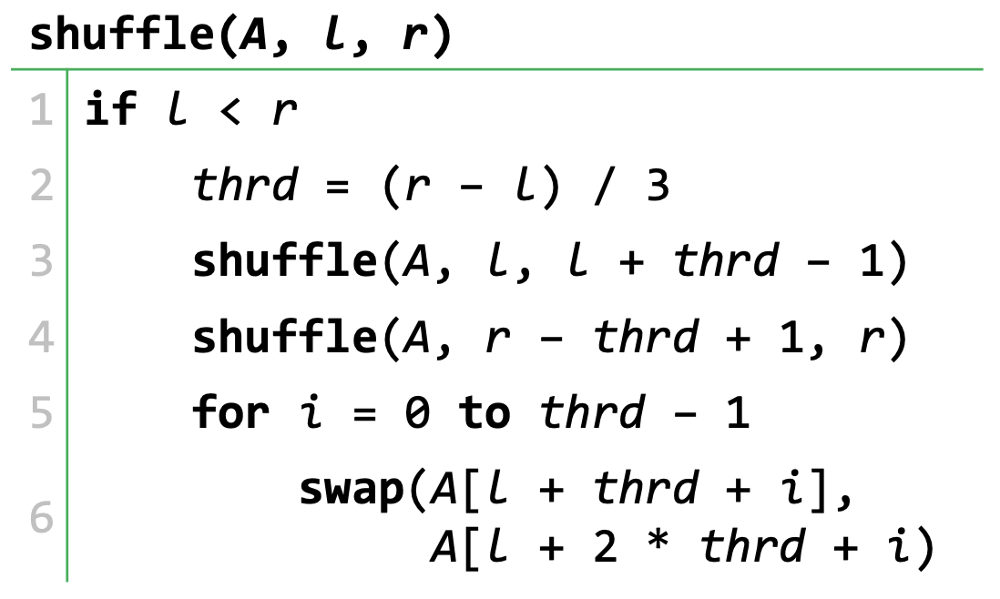
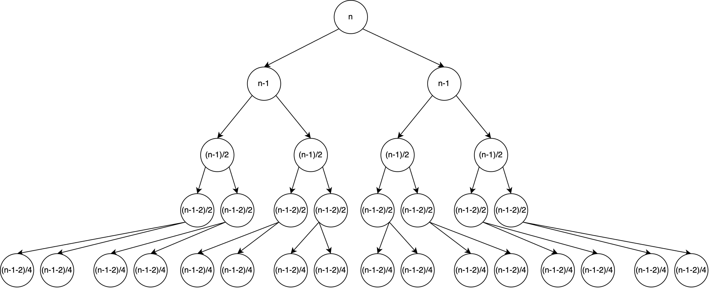

# Семинар 5

## ДЗ

### Перемешивание части массива третями

Для определенности будем считать, что рассматриваются полуинтервалы. Обозначим за $n$ длину рассматриваемого в данный момент подмассива: $n = r - l$. Тогда $thrd = \left\lfloor\frac{n}{3}\right\rfloor$.

В рекурсивную ветку вычислений входят $2$ вызова функции $\texttt{shuffle}$ на $3$ и $4$ строках, которые внесут в итоговое рекуррентное соотношение слагаемое $2T(thrd - 1) = 2T\left(\left\lfloor\frac{n}{3}\right\rfloor - 1\right)$.

В нерекурсивную ветку вычислений входят операция сравнения и присваивания, а также цикл, проходящий от $0$ до $thrd - 1$ и делающий на каждом шаге $\texttt{swap}$. Будем считать, что в сумме это $O\left(\left\lfloor\frac{n}{3}\right\rfloor - 1\right) + O(1) = O(n)$

Получим готовую рекурренту
$$
T(n) = 2T\left(\left\lfloor\frac{n}{3}\right\rfloor - 1\right) + O(n)
$$

Теперь хотим оценить полученную функцию временной сложности. Хотим воспользоваться мастер-теоремой. Для этого приведем нашу функцию к более красивому виду:

$$
T(n) \leq 2T\left(\frac{n}{3}\right) + O(n)
$$

$a = 2, b = 3, k = 1, f(n) = 1, \log_3 2 < 1$, тогда получим искомую верхнюю границу

$$
T(n) = O(n)
$$

### Задача трех T

$$
T(n) = \begin{dcases}
    2 \cdot T\left(\frac{n}{2}\right) + n & \qquad 2 \mid n\\
    2 \cdot T(n - 1) + n & \qquad 2 \nmid n\\
    1 & \qquad n = 1 
    \end{dcases}
$$

Задача сильно зависит от числа $n$, данного на вход алгоритма. Интересно посмотреть на то, как будет выглядеть число $n$ в двоичной записи. Еще нам понадобится вспомнить, что число в двоичной записи нечетное, если у него на конце единица, а деление на два – битовый сдвиг. Исследуем на примере, как будет меняться $n$ в нашем алгоритме:

$$
\begin{align*}
10010011000000111 &
\rightarrow 10010011000000110 \\
& \rightarrow 1001001100000011 \\
& \rightarrow 1001001100000010 \\
& \rightarrow 100100110000001 \\
& \rightarrow 100100110000000 \\
& \rightarrow 10010011000000 \\
& \rightarrow 1001001100000 \\
& \rightarrow 100100110000 \\
& \rightarrow 10010011000 \\
& \rightarrow 1001001100 \\
& \rightarrow 100100110 \\
& \rightarrow 10010011 \\
& \rightarrow 10010010 \\
& \rightarrow 1001001 \\
& \rightarrow 1001000 \\
& \rightarrow 100100 \\
& \rightarrow 10010 \\
& \rightarrow 1001 \\
& \rightarrow 1000 \\
& \rightarrow 100 \\
& \rightarrow 10 \\
& \rightarrow 1
\end{align*}
$$

Все становится очень понятно!!! Если $2 \mid n$, то  применяется битовый сдвиг, иначе $0$ на конце вычитанием переводится в $1$, а затем в любом случае применится битовый сдвиг.

Это и есть высота нашего дерева. Она выражается как
$$
\underbrace{\left\lfloor\log_2 n\right\rfloor}_\texttt{no. shifts} + \underbrace{m(n)}_\texttt{no. subs}
$$
где $m(n)$ – количество единиц в двоичной записи числа.

В одной из [задач SET-1](../set01/a2/a2.pdf), мы уже выражали эту функцию (там она обозначалась как $f(n)$):
$$
m(n) = n - \sum_{i = 1}^{\left\lfloor\log_2 n\right\rfloor} \left\lfloor\frac{n}{2^i}\right\rfloor
$$

Тогда высота дерева:

$$
\left\lfloor\log_2 n\right\rfloor + n - \sum_{i = 1}^{\left\lfloor\log_2 n\right\rfloor} \left\lfloor\frac{n}{2^i}\right\rfloor
$$

Так как мы ищем асимптотическую верхнюю границу, будем рассматривать только худший случай. Он достигается, когда все цифры в двоичной записи – единицы ($n = 2^k - 1$). В таком случае высота дерева:
$$
2 \left\lfloor\log_2 n\right\rfloor
$$

В построенном худшем случае каждый раз один шаг будет уходить на вычитание и последующий за ним наг – уменьшение $n$ вдвое. Тогда и рассматривать эти шаги будем тоже парами:

| no. pair |                    first                    |             second              |
| :------: | :-----------------------------------------: | :-----------------------------: |
|    0     |                    $n-1$                    |         $\frac{n-1}{2}$         |
|    1     | $\frac{n - 1}{2} - 1 = \frac{n - 1 - 2}{2}$ |      $\frac{n - 1 - 2}{4}$      |
|    2     |          $\frac{n - 1 - 2 - 4}{4}$          |    $\frac{n - 1 - 2 - 4}{8}$    |
|   ...    |                     ...                     |               ...               |
|   $i$    |         $\frac{n - (2^i - 1)}{2^i}$         | $\frac{n - (2^i - 1)}{2^{i+1}}$ |
|   ...    |                     ...                     |               ...               |

На каждом шаге рекурсии (уровне нашего дерева) выполняется $2^i$ подзадач размера $\frac{n}{2^i}$ каждая.

Финальные вычислительные действия:

$$
\begin{align*}
T(n) & = n + \sum_{i = 0}^{log_2 (n + 1) - 2} \left( 2^{2i + 1} \cdot \frac{n - (2^i - 1)}{2^i} + 2^{2i + 2} \cdot \frac{n - (2^i - 1)}{2^{i+1}} \right) \\
& = n + \sum_{i = 0}^{log_2 (n + 1) - 2} \left( 2^{i + 1} \cdot (n - (2^i - 1)) + 2^{i + 1} \cdot (n - (2^i - 1)) \right) \\
& = n + \sum_{i = 0}^{log_2 (n + 1) - 2} \left( 2^{i + 2} \cdot (n - 2^i + 1)\right) \\
& = n + n \sum_{i = 0}^{log_2 (n + 1) - 2} 2^{i + 2} - \sum_{i = 0}^{log_2 (n + 1) - 2} 2^{2i + 2} + \sum_{i = 0}^{log_2 (n + 1) - 2} 1 \\
& = n + \log_2 (n + 1) - 1 + n \sum_{i = 0}^{log_2 (n + 1) - 2} 2^{i + 2} - \sum_{i = 0}^{log_2 (n + 1) - 2} 2^{2i + 2} \\
& = n + \log_2 (n + 1) - 1 + n \sum_{i = 2}^{log_2 (n + 1)} 2^{i} - \sum_{i = 2}^{log_2 (n + 1)} 4^{i} \\
& = n + \log_2 (n + 1) - 1 + 4n (2^{\log_2 (n + 1) - 1} - 1) - \frac{16}{3}(4^{\log_2(n+1) - 1}-1) \\
& \leq n + \log_2 (n + 1) - 1 + 4n (n + 1) - \frac{16}{3}\left(\frac{(n+1)^2}{4} - 1\right) = O(n^2)\\
\end{align*}
$$

